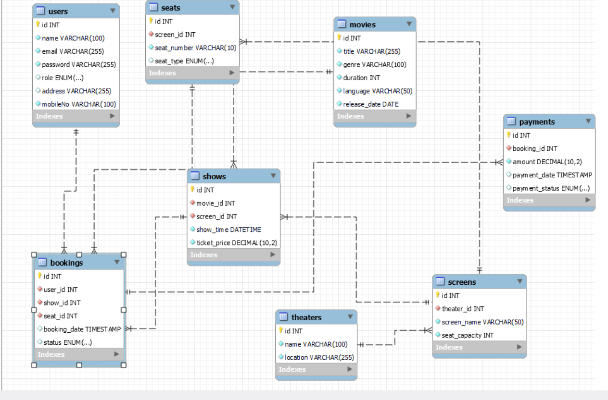

# Movie Ticket Booking System

This project is a **Hibernate-based application** designed to facilitate online movie ticket bookings. The system is designed to manage theaters, movies, shows, and bookings, ensuring a seamless experience for both customers and administrators. Below is an overview of the system and its features.

## ER Diagram


The above ER diagram represents the database structure for this project.

## Features

### Users
- Customers can create accounts, log in, and book tickets.
- Admins can manage movies, shows, and theaters.

### Movies and Shows
- Information about movies, such as title, genre, duration, language, and release date.
- Show scheduling with details like screen, show time, and ticket price.

### Bookings
- Users can book tickets for specific shows and seats.
- Booking statuses are managed.

### Payments
- Payment details include amount, date, and payment status.
- Secure and reliable transaction handling.

### Theaters and Screens
- Multiple theaters, each with various screens.
- Each screen has specific seat capacities.

### Seats
- Seat management with types and availability tracking.

## Technology Stack
- **Backend**: Hibernate, Java
- **Database**: MySQL
- **Build Tool**: Maven
- **Version Control**: Git

## Project Structure
```
src/
├── main/
│   ├── java/
│   │   ├── com.moviebooking/
│   │   │   ├── controllers/
│   │   │   ├── services/
│   │   │   ├── entities/
│   │   │   ├── repositories/
│   │   │   └── utils/
│   ├── resources/
│   │   ├── application.properties
│   │   ├── hibernate.cfg.xml
│   │   └── log4j.properties
├── test/
```

## Setup and Installation
1. Clone the repository:
   ```bash
   git clone https://github.com/lucky001118/Movie_Tickit_Booking_System.git
   ```
2. Import the project into your IDE (e.g., IntelliJ IDEA or Eclipse) as a Maven project.
3. Configure the database connection in `hibernate.cfg.xml` located in the `resources` directory.
4. Run the application.

## Usage
1. Launch the application.
2. Create user accounts (admin or customer).
3. Admins can manage movies, theaters, and shows.
4. Customers can browse shows, book tickets, and make payments.

## Future Enhancements
- Integration with a payment gateway for real-time transactions.
- Implementation of REST APIs for external integrations.
- A frontend interface using frameworks like React or Angular.

## Repository
Find the complete project here: [Movie Ticket Booking System](https://github.com/lucky001118/Movie_Tickit_Booking_System)

## Contributions
Contributions are welcome! Please fork the repository and submit a pull request for any enhancements or bug fixes.

## License
This project is licensed under the MIT License.
```

